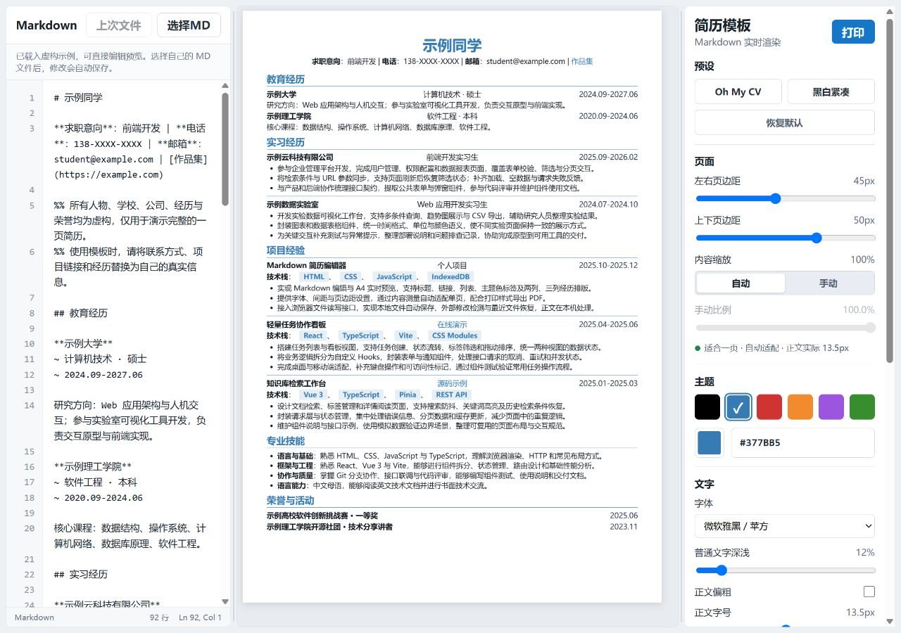

# Markdown 简历编辑器

一个无需安装依赖的纯前端简历编辑器。使用 HTML、CSS 和原生 JavaScript，将 Markdown 实时渲染为 A4 简历，并通过浏览器打印导出 PDF。

**在线使用：** [Markdown 简历编辑器](https://qingyingxy.github.io/markdown-resume-editor/)

## 界面预览

截图展示一份完整的一页虚构简历，包含教育、实习、项目、技能与荣誉，以及 Markdown 编辑和排版设置。



## 功能

- 打开即显示完整的一页虚构示例简历，可直接编辑和体验排版。
- Markdown 编辑、行号与实时预览。
- A4 排版，支持自动适配单页与手动内容缩放。
- 调节页边距、字体、字号、主题色、文字深浅及段落间距。
- 支持两列、三列对齐，以及只在编辑器中显示的注释。
- 拖动调整编辑区、预览区和设置栏宽度。
- 在支持的浏览器中绑定本地 Markdown 文件，自动保存网页修改并读取外部修改。
- 记住样式设置和最近绑定的文件；文件权限失效时可重新授权。

## 快速开始

推荐在桌面版 Chrome 或 Edge 中使用。

1. 打开 [在线编辑器](https://qingyingxy.github.io/markdown-resume-editor/)，页面会自动展示一份虚构示例简历。
2. 在左侧直接修改示例内容，在右侧调整字体、主题色与排版参数。
3. 使用自己的简历时，点击 **选择MD**，选择本地 `.md` 文件并允许浏览器读写。
4. 点击 **打印**，将纸张设置为 A4、关闭页眉和页脚，并选择“另存为 PDF”。如需保留主题色，请开启打印窗口中的背景图形选项。

如果此前绑定过文件且浏览器权限仍有效，打开页面时会优先恢复该文件。示例 Markdown 也可从 [example.md](examples/example.md) 查看或下载。

也可以直接把 Markdown 粘贴到编辑器中预览和打印。**只有绑定本地文件后才会自动保存正文**；未绑定文件时，请自行保留内容，避免刷新后丢失。

本地使用时，下载项目后双击打开 `index.html` 即可，无需安装依赖或构建。

## Markdown 写法

支持常用的简历语法和以下排版扩展，暂不提供完整的 Markdown 标准支持。

### 姓名与联系方式

一级标题作为姓名，其后的第一段作为联系方式：

```md
# 示例同学

**电话**：138-XXXX-XXXX | **邮箱**：student@example.com | **主页**：[作品集](https://example.com)
```

### 分区、重点与标签

```md
## 教育经历
## 项目经验
## 技能

这是**重点内容**，这是一个 `JavaScript` 标签。

- 支持无序列表。
1. 支持有序列表。
```

反引号内容会渲染成带主题色的标签。项目之间可使用 `---` 添加分割线。链接支持 `http://` 和 `https://` 地址。

### 日期与分栏

符合以下格式的行尾日期会自动靠右：

```md
**示例大学 · 本科 （2022.09-2026.06）**
```

一个 `~` 表示左右两列，连续两个 `~` 表示左、中、右三列：

```md
**示例大学 · 计算机科学与技术**
~ 2022.09-2026.06

**示例科技有限公司**
~ 前端开发实习生
~ 2025.06-2025.09
```

正文与 `~` 行之间不要插入空行。

### 注释

以 `%%` 开头的整行只在编辑器中保留，不会出现在预览与打印结果中：

```md
%% 这是一条备用表述。
```

注释前可有空格；多行备注需为每行添加 `%%`。

## 浏览器与数据说明

- 自动读写本地文件依赖 File System Access API，推荐新版桌面 Chrome 或 Edge，并使用 HTTPS 或 localhost 页面。
- Firefox、Safari 及部分移动浏览器不支持当前的文件绑定方式；可以粘贴正文进行预览和打印，但不能使用自动写回功能。
- 简历正文在浏览器中处理。当前代码没有上传接口，也没有第三方脚本；选择本地文件不会将正文提交到 GitHub。
- 样式设置保存在浏览器的 localStorage，最近文件句柄保存在 IndexedDB。清理站点数据后需重新选择文件。
- 页面访问会向静态托管服务请求 HTML、CSS 和 JavaScript；点击简历中的外部链接会访问对应网站。
- 字体需在本机安装，未安装时会使用后备字体。
- 自动缩放最低为 80%，同时受最低有效字号限制；仍超出一页时会提示。当前主要面向单页简历。

## 项目结构

```text
.
├── index.html           # 页面与控件
├── styles.css           # 编辑器、简历与打印样式
├── app.js               # 渲染、排版与本地文件同步
├── docs/screenshots/    # 界面与简历排版截图
├── examples/
│   └── example.md       # 与默认预览一致的虚构示例
├── .gitignore           # 仅允许发布项目文件
├── .gitattributes       # 文本文件换行规范
├── .nojekyll            # GitHub Pages 按静态文件发布
└── README.md
```
